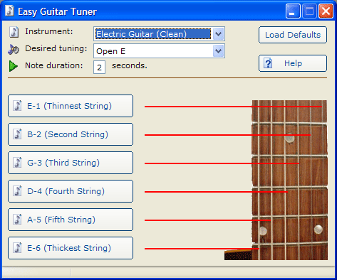



## Advanced Guitar Tuner \(MIDI API\)

### Description

This is a guitar tuner that uses the Windows MIDI API functions. It supports 36 different tunings and 7 guitars. It comes with a class module I wrote that simplifies using the MIDI functions. Please leave a comment if you find it useful, as this took me quite awhile to figure out.
 
### More Info
 

             |
---                |---
**Submitted On**   |2005-02-13 05:34:06
**By**             |[Daniel W Elkins](https://github.com/Planet-Source-Code/PSCIndex/blob/master/ByAuthor/daniel-w-elkins.md)
**Level**          |Intermediate
**User Rating**    |5.0 (100 globes from 20 users)
**Compatibility**  |VB 4\.0 \(32\-bit\), VB 5\.0, VB 6\.0
**Category**       |[Complete Applications](https://github.com/Planet-Source-Code/PSCIndex/blob/master/ByCategory/complete-applications__1-27.md)
**World**          |[Visual Basic](https://github.com/Planet-Source-Code/PSCIndex/blob/master/ByWorld/visual-basic.md)
**Archive File**   |[Advanced\_G1852192132005\.zip](https://github.com/Planet-Source-Code/daniel-w-elkins-advanced-guitar-tuner-midi-api__1-58874/archive/master.zip)

